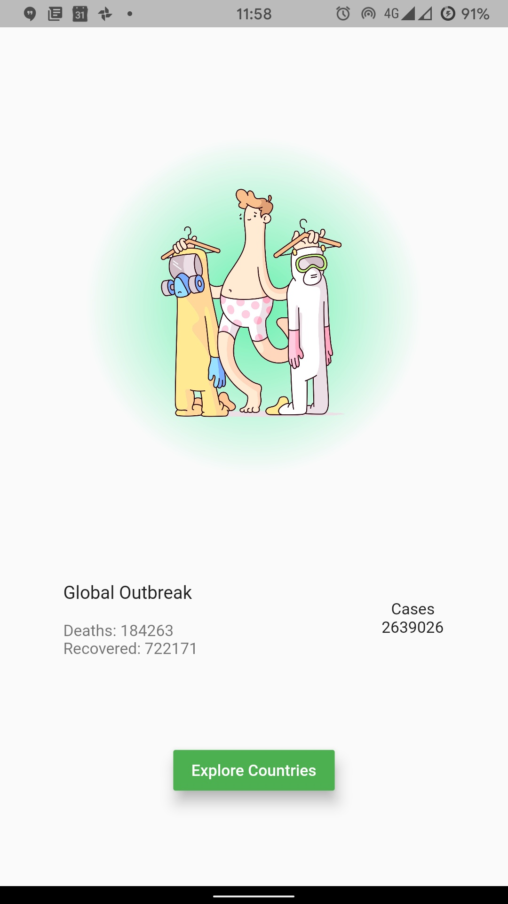
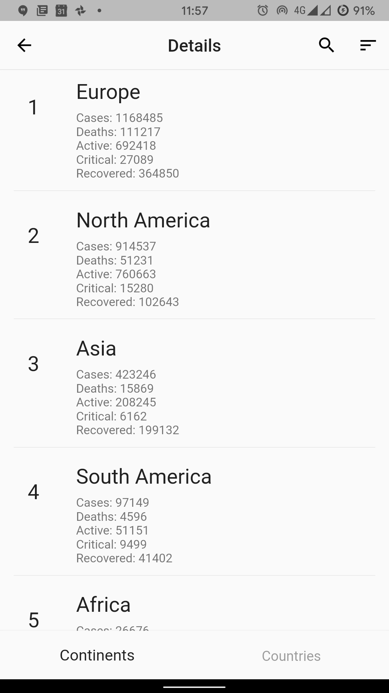
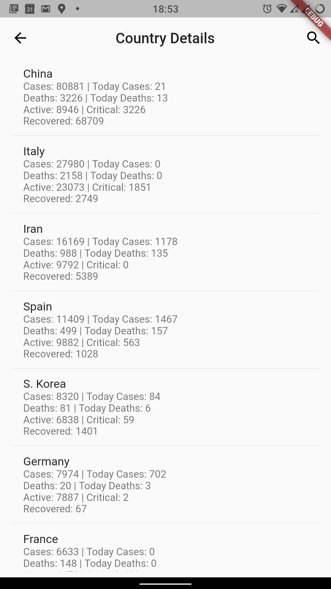
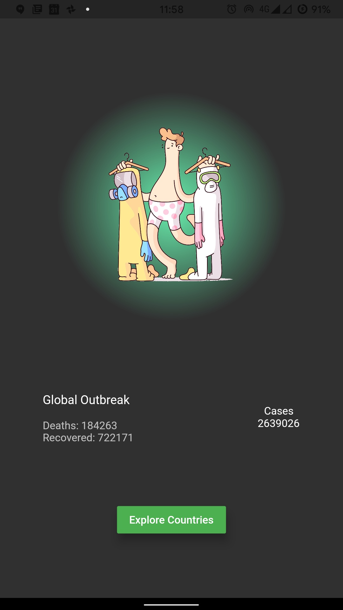
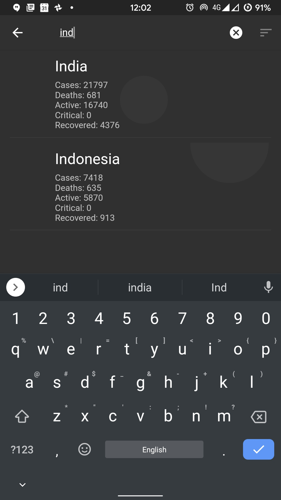
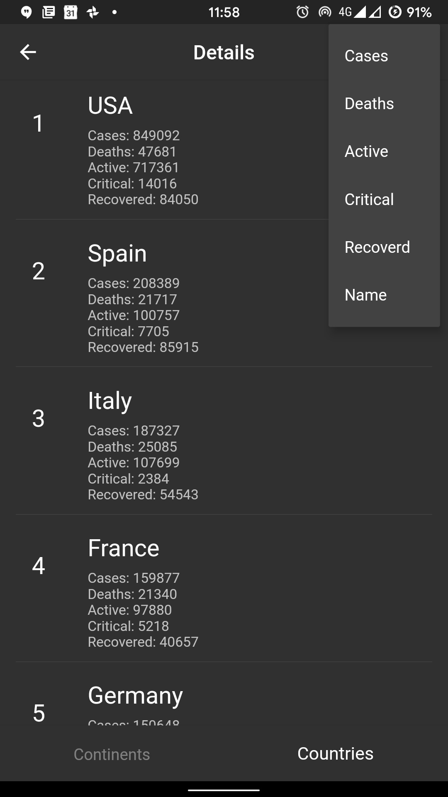

# Corona Tracker

Track the outbreak of the Corona Virus.

## Screenshots

**Light Theme**

    
    
    

**Dark Theme**

    
    
    

## Features
- Display the total cases of *COVID-19* diseases world wide, along with
  the number of casualties and recovered
- Get the details of all affected countries and continents along with rankings like..
  - Cases
  - Deaths
  - Active cases
  - Critical cases
  - Number of recovered people
  - Name
- Sort the list of countries accordingly
- Search of an individual country or continent
- How the visual diagram and other stats when clicked on a country or continent
## Credits
- [API](https://github.com/javieraviles/covidAPI) is provided by [Javier
  Aviles](https://github.com/javieraviles)
- Font page logo by [Burnt Toast](https://dribbble.com/BurntToast)
- Light theme loading indicator by [Hayk Tsirunyan](https://dribbble.com/tsirunyan) and [Mohamed 
  Abdelkader](https://dribbble.com/mkader)
- Dark theme loading indicator by [Frances Van Eyck](https://dribbble.com/francesvaneyck)