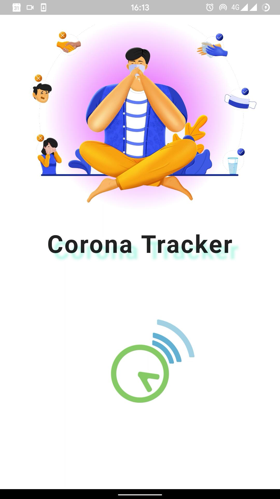

# Corona Tracker

Track the outbreak of the Corona Virus.

## Demo

### Light

    
    
    

    
    
    

    
    

### Dark

    
    
    

    
    
    

    
    
    

    
    

## Designs

Desiging is done by [Rituparna Bhattacharya](https://github.com/rituparna-bhattacharya)

## Download

Download the [v2.0.0-alpha](https://github.com/RitamChakraborty/corona_tracker/releases/download/v2.0.0-alpha) version from [here](https://github.com/RitamChakraborty/corona_tracker/releases/download/v2.0.0-alpha/Corona_Tracker_v2.0.0-alpha.apk)

## API

Using official [disease.sh](https://disease.sh/) API

- [Global](https://disease.sh/v3/covid-19/all)
- [Continents](https://disease.sh/v3/covid-19/continents)
- [Countries](https://disease.sh/v3/covid-19/countries)

## Packages Used

- [http](https://pub.dev/packages/http)
- [flutter_svg](https://pub.dev/packages/flutter_svg)
- [provider](https://pub.dev/packages/provider)
- [flutter_bloc](https://pub.dev/packages/flutter_bloc)
- [intl](https://pub.dev/packages/intl)
- [google_nav_bar](https://pub.dev/packages/google_nav_bar)

